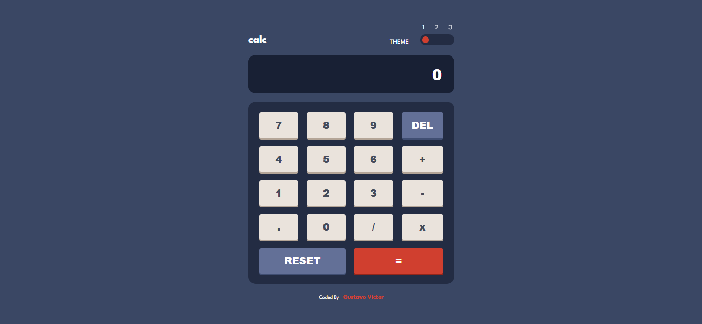
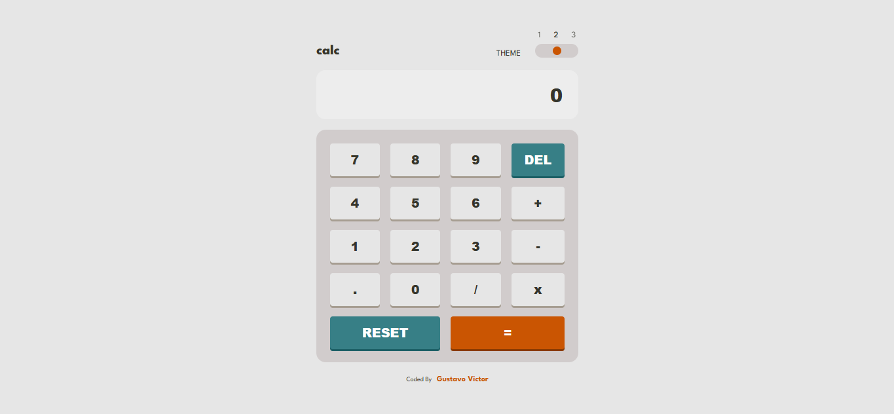
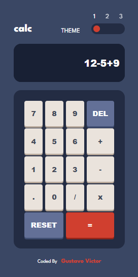
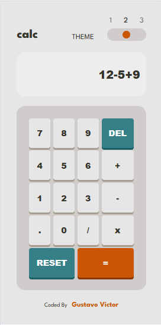
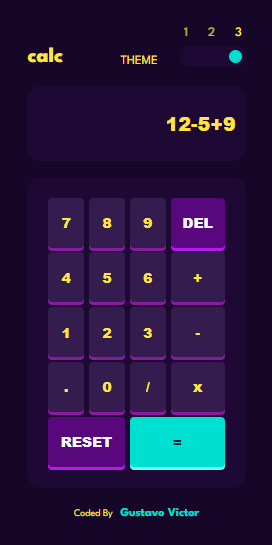

# Calculator app (solução)

Este repositório é uma solução do desafio [Calculator app do Frontend Mentor](https://www.frontendmentor.io/challenges/calculator-app-9lteq5N29). 

<hr />

## Tabela de conteúdos

- [Sobre](#overview)
  - [O desafio](#o-desafio)
  - [Screenshots](#screenshots)
  - [Links](#links)
- [Instalação](#instalação)
  - [Pré-requisitos](#pre-requisitos)
  - [Como começar](#como-começar)
- [Meu processo](#meu-processo)
  - [Ferramentas](#ferramentas)
  - [O que aprendi](#o-que-aprendi)
- [Licença](#licença)  
- [Autor](#autor)


## Sobre

### O desafio

Usuários são capazes de:

- Ver o tamanho dos elementos da página ajustados ao tamanho de tela do dispositivo
- Realizar operações aritméticas básicas como adição, subtração, multiplicação, divisão, além de apagar símbolos e resetar o cálculo
- Mudar o tema da aplicação para atender às suas preferências e salvar o tema no armazenamento local do navegador (localStorage)


### Screenshots





<br/>





### Links

- [URL da solução](#)
- [Aplicação](#)

## Instalação

### Pré requisitos

Para executar esta aplicação na sua máquina local, aqui vai uma lista de requisitos: 

- [NPM](https://npmjs.com/) e [Node](https://nodejs.org/)
- Editor de código (Recomendo o [Visual Studio Code](https://code.visualstudio.com/))
- Conhecimentos prévios em HTML, CSS, JS e ReactJS 

### Como começar 

Siga o passo a passo para instalação: 

1. Clone o projeto ou faça download do ZIP: 

```bash
    # abra o terminal (Git Bash de preferência) e digite 
    $ git clone https://github.com/Gustavo-Victor/calculator-app.git
    # não precisa fazer isso se já tiver feito download do projeto (nesse caso, só extraia a pasta e entre nela)
```

2. Entre na pasta do projeto:

```bash
    $ cd calculator-app/
```

3. Instalar as dependências: 

```bash
    $ npm install yarn -g && yarn;
    # se não funcionar, então execute o comando: npm install  
```

4. Executar a aplicação no mode de desenvolvimento: 

```bash
    $ yarn dev
```

5. Abra o projeto no seu navegador de preferência:
    - Digite no seu navegador o URL: http://localhost:5173/


## Meu processo

### Ferramentas

- HTML5
- CSS Grid
- CSS Flexbox
- Abordagem Mobile-first
- [React](https://reactjs.org/) - Biblioteca JS
- [Vite](https://vite.dev/) - Ferramenta de construção super rápida e moderna voltada para o desenvolvimento Front-End  
- [Styled Components](https://styled-components.com/) - para os estilos e temas
- [MathJS](https://www.npmjs.com/package/mathjs) - para realizar os cálculos básicos 


### O que aprendi

No processo de criação desta aplicação, pude revisar conhecimentos em HTML, CSS, JS e React e pude aprender mais sobre como usar temas no Styled Components e aprendi uma biblioteca nova que o MathJS que facilita muito no processo de converter strings em cálculos matemáticos. 

Alguns exemplos de código:

- Criação de provedor de tema usando o "ThemeProvider" do Styled Components
```js
// ...
export default function ThemeProviderContainer({children, theme}) {
  return (
    <ThemeProvider theme={theme}>
        {children}
    </ThemeProvider>
  )
}
//...
```

- Realização de cálculo usando mathjs: 
```js
 // ...
  const handleCalculate = () => {
      try {
        const result = evaluate(currentNumber); 
        setCurentNumber(String(result)); 
       }
        catch (error) {
          setCurentNumber("Error");
          console.log(error); 
        }
  }
 // ...
```

## Licença 

Este projeto está sob a licença MIT. Clique [aqui](./LICENSE) para obter mais detalhes. 

## Autor

- Website - [Gustavo Victor](https://gustavo-victor-portfolio.vercel.app/)
- Frontend Mentor - [@Gustavo-Victor](https://www.frontendmentor.io/profile/Gustavo-Victor)
- Discord - [@gustavovbs](#)

<hr />

Com ❤️ por [Gustavo Victor](https://github.com/Gustavo-Victor)